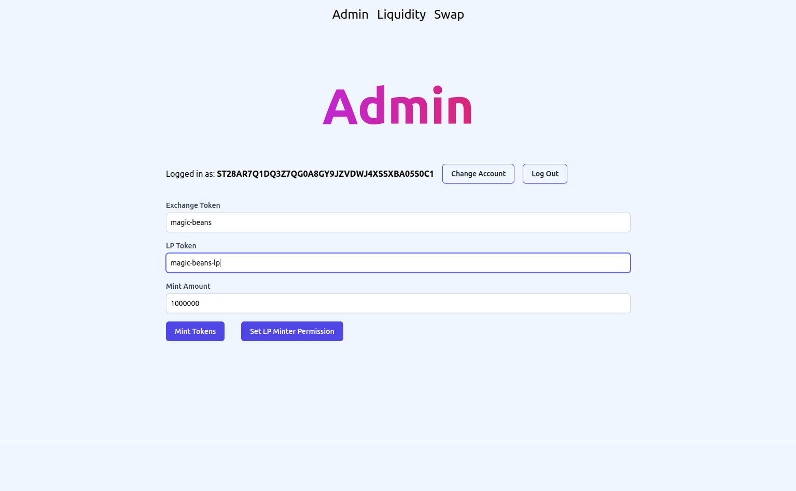
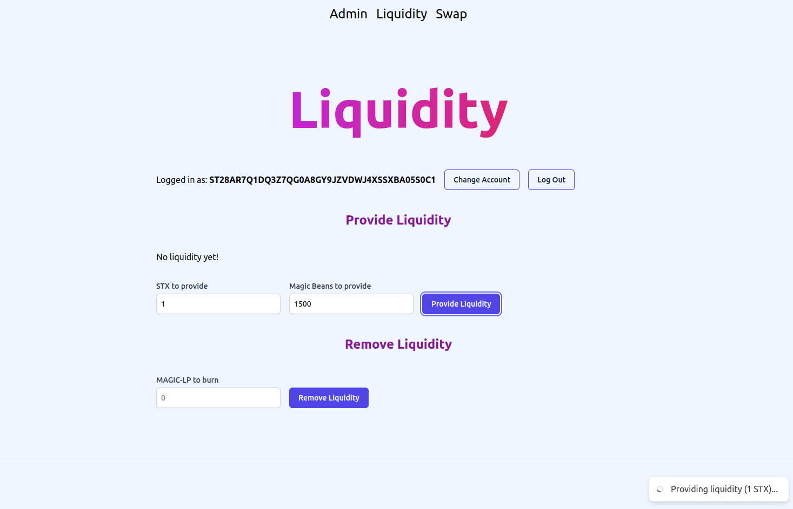
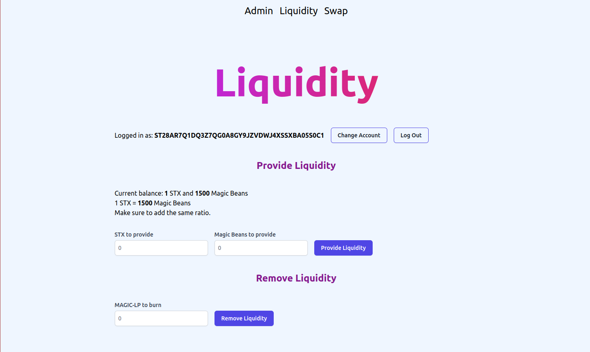
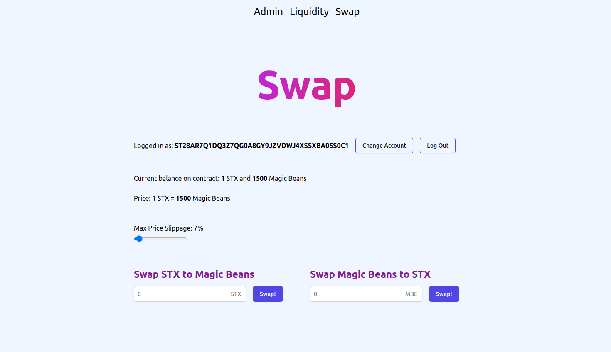

# Dex on Stacks

A Decentralized Exchange on Stacks where users can provide liquidity and earn a LP token. Users can then swap their STX for fungible tokens, and vice versa, paying a small fee in the process. Liquidity provider can then burn their LP tokens to recover their liquidity plus the fees charged to users who swap their STX for fungible token.

## Mint custom fungible token

In the admin page, we can select the fungible token to put on the exchange and the LP token that will be earned by liquidity providers. We then give ownership of the LP token to the exchange that will mint token for liquidity providers.

## Provide liquidity to Exchange

Here users can provide/remove liquidity to the exchange.

## Swap

Here users can can swap their STX for the fungible token or the other way around.

## Deployment

The various version of this contract are deployed on the Testnet at the address: [ST28AR7Q1DQ3Z7QG0A8GY9JZVDWJ4XSSXBA05S0C1](https://explorer.stacks.co/address/ST28AR7Q1DQ3Z7QG0A8GY9JZVDWJ4XSSXBA05S0C1?chain=testnet)