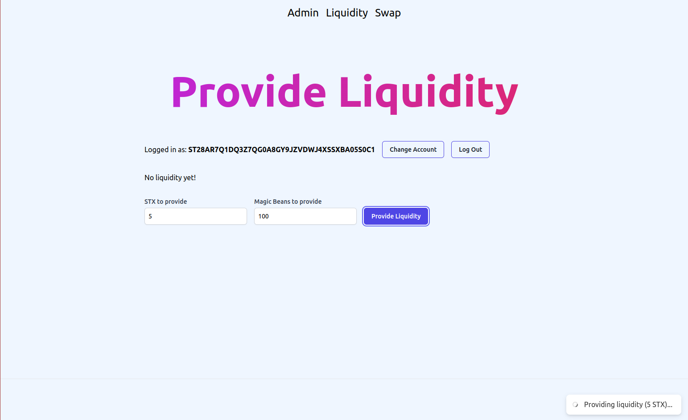

# Dex on Stacks

A Decentralized Exchange on Stacks where users can provide liquidity and earn a LP token. Users can then swap their STX for fungible tokens, and vice versa, paying a small fee in the process. Liquidity provider can then burn their LP tokens to recover their liquidity plus the fees charged to users who swap their STX for fungible token.

## Mint custom fungible token

## Provide liquidity to Exchange

## Swap

